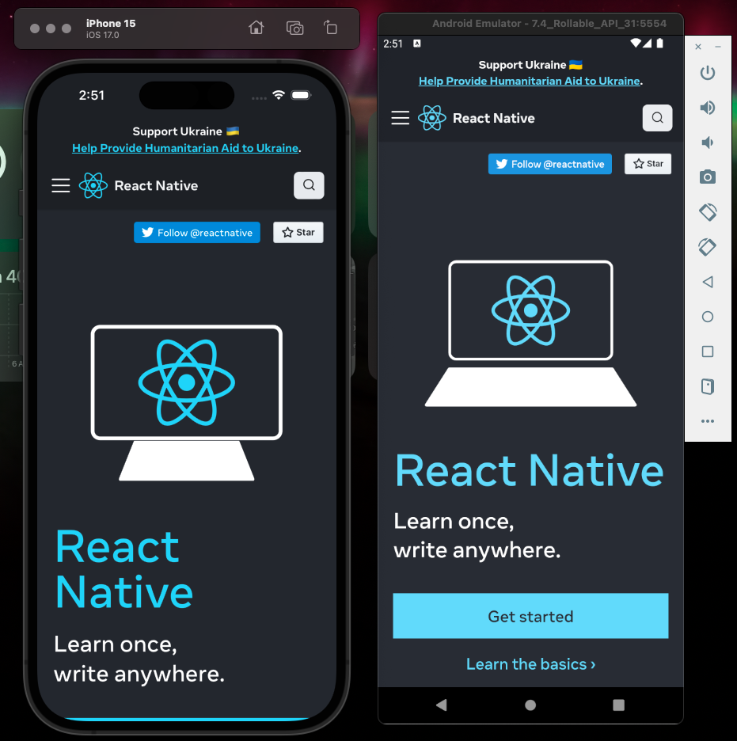

# Shift2App

🚀 Convert Your Web App to Native Android and iOS Apps Effortlessly!

<div align="center">
  
</div>

Shift2App is a powerful tool that streamlines the process of converting your responsive web app into native Android and iOS applications. With easy-to-use configurations and seamless integration, Shift2App saves you valuable time and effort, allowing you to expand your user base across multiple platforms quickly.

## Why Shift2App?

⏱️ **Save Time:** Say goodbye to time-consuming development. With Shift2App, you can convert your web app to native mobile apps in minutes, not weeks.

📱 **Multi-Platform Deployment:** Reach a wider audience by deploying your app on both Android and iOS platforms simultaneously.

🛠️ **Easy Configuration:** Customize your app with environment-based configurations for package name, app name, icons, logo, splash screen, version codes, and more.

🌐 **Webview Integration:** Seamlessly integrate web content into your native app using flexible webview configurations.

## Getting Started

Follow these steps to get started with Shift2App:

#### 1. Clone this repository.

```bash
git clone https://github.com/iamsrikanthnani/Shift2App
```

#### 2. Navigate to the project directory.

```bash
cd Shift2App
```

#### 3. Install dependencies:

```bash
yarn install
```

or `npm install`

#### 4. Run the app on Android:

```bash
yarn android
```

or `npm android`

#### 5. Run the app on iOS:

```bash
yarn ios
```

or `npm ios` don't forget to run `cd ios/pod install`

## Future Development

- Adding support for animated splash screens with customizable logos.
- Introducing environment-based configurations for app name, icons, logo, version codes, and webview URL([check this repo](https://github.com/iamsrikanthnani/react-native-template)).
- Over-the-Air(OTA) updates

## Contribution

Contributions are welcome! Feel free to open issues and pull requests to improve Shift2App.

## Contact

📧 **Contact Me:** For assistance with setup, configurations, or any additional features, feel free to reach out to me at [srikanthnani1202@gmail.com](mailto:srikanthnani1202@gmail.com).

## License

This project is licensed under the [MIT License](LICENSE).
